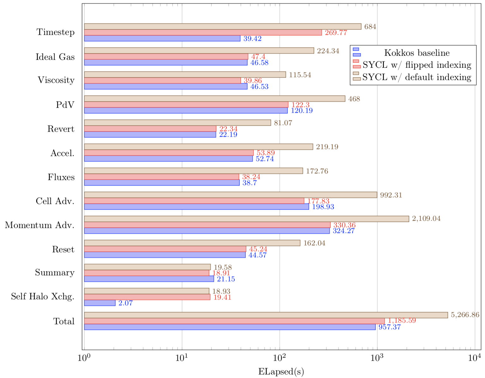

The SYCL programming model from Khronos is a single-source C++ open-standard programming model for programming heterogeneous systems.
It is based on modern C++11 and the current version (1.2.1) is built on top of OpenCL, allowing it to target a very wide range of different architectures.
A major focus of the HPC Research Group at the University of Bristol is performance portability.
You can find out about our latest work in our recent P3HPC publication ([paper](https://conferences.computer.org/sc19w/2019/pdfs/P3HPC2019-4EEo872AT37XFNn0hNAzRv/28Dv6zrZOx4Ed9bIsN7Le2/6QPaLH6KpgoskTkAyLU1vj.pdf) and [slides](https://drive.google.com/open?id=1VcF5YBN_4Mt9ScBYP-pNMHQZONeeD0__)).
SYCL therefore provides an exciting opportunity to explore if performance portability is possible with this model.

We first wrote about SYCL [in our paper published in 2016](https://http://link.springer.com/10.1007/978-3-319-46079-6_34) exploring the achievable memory bandwidth from various programming models across a wide range of hardware with our [BabelStream benchmark](http://uob-hpc.github.io/BabelStream).

[CloverLeaf](http://uk-mac.github.io/CloverLeaf/) is a hydrodynamics mini-app.
Although originally implemented in Fortran with OpenMP for running on the CPU, we have over the past few years been developing ports in the most commonly used parallel programming models used today.
You can find the ports hosted on GitHub at [UK-MAC](https://github.com/uk-mac/?utf8=✓&q=cloverleaf&type=&language=) or here on the [UoB-HPC page](https://github.com/UoB-HPC?utf8=✓&q=cloverleaf&type=&language=).

## Porting CloverLeaf to SYCL

We have most recently ported CloverLeaf to SYCL, and this blog post demonstrates our experiences.

As a starting point, we took our [Kokkos port of CloverLeaf](https://github.com/uob-hpc/cloverleaf_kokkos), which was already C++ throughout, with the key computational kernels already ported to C++ lambda functions.
The programming abstractions from Kokkos do differ a little to those in SYCL at a high-level, however there are many similarities.
The following table details a rough equivalence between the abstractions in Kokkos and SYCL:

| Type                | Kokkos                                  | SYCL                            |
|---------------------|-----------------------------------------|---------------------------------|
| Data storage        | `Kokkos::View`                          | `cl::sycl::buffer`              |
| Data view           | `Kokkos::View`                          | `cl::sycl::accessor`            |
| Compute (for)       | `Kokkos::parallel_for`                  | `cl::sycl::parallel_for`        |
| Compute (reduction) | `Kokkos::parallel_reduce`               | User supplied                   |
| Kernel body         | `KOKKOS_LAMBDA(const size_type i){...}` | `[=](cl::sycl::id<N> idx){...}` |
| Range policy        | `Kokkos::MDRangePolicy`                 | `cl::sycl::range`               |

### Allocating data

Each 1D and 2D `Kokkos::View` used to store the data could be converted into a similarly dimension `cl::sycl::buffer`: e.g. `Kokkos::View<double**>` became `cl::sycl::buffer<double, 2>`. Note that sizes of the buffers must be determined upon construction.


### Iteration spaces

Due to halo regions in the data buffers, the index space for the parallel execution of kernels (lambda functions) does not start at 0. The `Kokkos::MDRangePolicy` allows specifying start and end iteration numbers. A SYCL `cl::sycl::range` however details the extent of the iteration along with an offset for the starting index.

A small abstraction class was implemented to convert the "begin and end" approach into "extent with offset" approach.
This logically maps the iteration space from that of the program into the model used by SYCL.

#### Index offsets
The base type of a `cl::sycl::id` is `size_t`, i.e. an unsigned value.
CloverLeaf kernels often require access to neighbouring values (in a stencil-list manner) and this requires offsetting the index by plus/minus 1 in each dimension and so we find that the following is not necessarily true:
```
( cl::sycl::id<2>(1, 1) + cl::sycl::id<2>(-1, -1) ) == cl::sycl::id<2>(0, 0)
```

To do this safely, we must extract the constituent parts of the `cl::sycl::id` as `id[0]` and `id[1]`, perform the subtraction and create a new `cl::sycl::id` object to access the buffer.
For ease, we wrapped this in a function:
```
static inline cl::sycl::id<2> offset(const cl::sycl::id<2> idx, const int j, const int k) {
  int jj = static_cast<int>(idx[0]) + j;
  int kk = static_cast<int>(idx[1]) + k;
  // assert(jj >= 0); assert(kk >= 0);
  return cl::sycl::id<2>(jj, kk);
}
```
This can be used in the kernel to save the repetitive unpacking and repacking of the offset, for example:
```
A[offset(idx, -1, -1)] = ...
```

Alternatively, we could also use the multi-dimension accessor notation in SYCL as follows:
```
A[idx[0]-1][idx[1]-1] = ...
```

### Capturing kernel buffer access
A key component in SYCL is that kernels are enqueued and scheduled on the device according to the data dependencies of the buffers they use.
To this end, buffer objects are not used directly in the kernel.
Instead, buffer accessors are used, which define whether the buffer is read-only/write-only/both/etc.
In this manner, the SYCL runtime can schedule kernels efficiently on the device, potentially running kernels in parallel.
There is limited opportunity for this in CloverLeaf however.

The structure of the original CloverLeaf was very amenable to porting the loop bodies to lambda functions as each kernel had it's own driver routine to specify only the data arrays needed (as simple data types) rather than passing large derived types (data structures) to kernels.
In particular, this means that in a plain C sense,  the kernel bodies see `double *` directly rather than must unpack this from a large structure.
This structure was convenient in our SYCL port, with the accessor type being passed to the kernel function (containing the lambda).
For instance:
```
queue.submit([&](cl::sycl::handler &cgh) {
  kernel(buffer.get_access<cl::sycl::access::mode::read>);
});
```

### Reductions
CloverLeaf has only two kernels that  require reduction (sum) operations.
Both sum up double precision scalar values, with one kernel producing a single value and a second producing five.
In OpenMP, one could easily describe these using the `reduction` clause:
```
#pragma omp parallel for reduction(+:vol,mass,ie,ke,press)
```

Kokkos contains first class support for reductions with the `Kokkos::parallel_reduce` executor.
However, if more than one scalar value needs to be reduced then a kernel functor must be written instead of using a lambda function for the kernel body.
The kernel functor requires operators which define how the user-defined structure containing the reduction variables are to be combined.
In this way, Kokkos can implement a parallel reduction using the operators defined, reducing the burden on the programmer despite the extra work involved.
The implementation can be seen in our [GitHub repository](https://github.com/UoB-HPC/cloverleaf_kokkos/blob/master/field_summary.cpp).


SYCL 1.2.1 does not contain a reduction operation, although Intel has proposed one as an extension (as part of oneAPI).
At the moment therefore, programmers must write their own reductions in SYCL codes.
For the CloverLeaf port, the reduction was modelled on that implemented in the [BabelStream `dot` kernel](https://github.com/UoB-HPC/BabelStream/blob/master/SYCLStream.cpp) which has been shown to perform well on both CPU and GPU architectures.
The reduction runs the kernel on each work-item in parallel, and then each work-group cooperatively reduces the values within each work-group following a tree.
It was found more optimal on the CPU architectures tested at this early stage to store the reduction values (one per work-group) to device global memory and launch a second serial kernel to sum these values up.
We will investigate this further as we run this port across CPU and GPU architectures from multiple vendors.


### Memory access patterns
The SYCL 1.2.1 specification details the data layout of 2D and 3D buffers as:
```
id3+(id2*r3)+(id1*r3*r2)
```
This means that it follows standard C/C++ array-of-array syntax, where the right-most index is contiguous (stride 1).
In particular for a 2D buffer, the following example shows correct access patterns:
```
cl::sycl::range<2> dims{nx, ny};
cl::sycl::buffer<double, 2> A{dims};
q.submit([&](cl::sycl::handler &cgh) {

  auto A = a.get_access<cl::sycl::access::mode::read_write>(cgh);

  cgh.parallel_for(dims, [=](cl::sycl::id<2> idx) {
    // The follow are equivalent
    A[idx] += 1.0;
    A[idx.get_linear_id()] += 1.0;
    A[idx[0]][idx[1]] += 1.0;
  });
});
```

The latest implementations of SYCL (i.e. Codeplay ComputeCpp CE 1.1.6 or greater) map the parallel work-items to the underlying OpenCL implementation in the same way.
This is not necessarily the case with older versions, as OpenCL does not specify which dimension of an `NDRange` should be linear!

Early versions of SYCL runtimes mapped the first dimension of a `cl::sycl::range` (`r1` in the specification) to OpenCL `get_global_id(0)` - the opposite of the linearisation defined in SYCL.
Performant access could be found via `A[idx[1]][idx[0]]` or allocating 1D buffers and ranges and writing your own linearisation routine.
The `A[idx]` notation was not performant as it still mapped to `A[idx[0]][idx[1]]`.

It is of course *very* important performance that the data layout matches the access patterns.
All SYCL runtimes going forward should map things correctly, and we can just use `A[idx]` and expect the behaviour which renders good performance.

### Performance pitfalls

Extraneous (captured but unused) accessors cause significant impact on performance.
Ideally these could be removed automatically as the compiler has knowledge of which accessors are actually used in the kernel.
For example:
```
using namespace cl::sycl;
auto a = buffer<double, 1>(range<1>(42));
auto b = buffer<double, 1>(range<1>(42));
queue q = //...
queue.submit([&](handler &h) {
   auto accessorA = a.get_access<RW>(h);
   auto bufferB = a.get_access<R>(h); // unused, remove
   h.parallel_for(range<1>(42), [=](id<1> idx) {
      accessorA[idx] = pow(accessorA[idx], accessorA[idx]);
   });
});
```

External references should be avoided in kernels.
This includes macros that could potentially expand to blocks containing external references, even if they are trivially unreachable.
Make sure all arithmetic functions are built-ins in the cl::sycl namespace.
External references in kernels does not always prevent the kernel from running on a CPU device, even though they should!
```
#include <assert.h>
parallel_for(range<1>(42), [=](id<1> idx) {
   assert(idx > 10); // expands to __assert_fail syscall
   std::abs(idx[0]); // external reference to c++ stdlib
});
```

## Performance results
The graph below shows performance results for the CloverLeaf Kokkos and SYCL versions running on a single socket Intel Xeon Gold 6126 (Skylake) node.
This CPU has 12 cores.
The Kokkos version was built with the Intel compiler 19.0.4, and used Kokkos v2.8.00.
The SYCL version was built with Codeplay ComputeCpp CE 1.1.3 (NB this version is earlier than the one with the fixed access patterns as identified above).

The graph below shows the runtimes of the Kokkos and SYCL version.
Each CloverLeaf kernel is shown in isolation, with the total runtime shown at the bottom.
It is clear that Kokkos and SYCL have very similar runtimes for almost all the kernels, as long as the memory access pattern for SYCL is correct.
The reductions kernels (Timestep and Summary) show some further opportunity for optimisation remains.




## Summary
Porting a hydrodynamics mini-app to SYCL from Kokkos was a fairly straightforward process.
The mappings of `cl::sycl::range` to an underlying OpenCL implementations in early versions of the SYCL runtime led to poor performance with idiomatic SYCL code, however the latest versions resolve this issue well.

Do keep an eye out for more SYCL results in the coming months as we expand our [performance portability study](https://conferences.computer.org/sc19w/2019/pdfs/P3HPC2019-4EEo872AT37XFNn0hNAzRv/28Dv6zrZOx4Ed9bIsN7Le2/6QPaLH6KpgoskTkAyLU1vj.pdf) to include SYCL versions.

## Acknowledgements
This work was supported through ASiMoV under EPSRC grant number EP/S005072/1.

© Crown copyright 2019/Mod/AWE.
